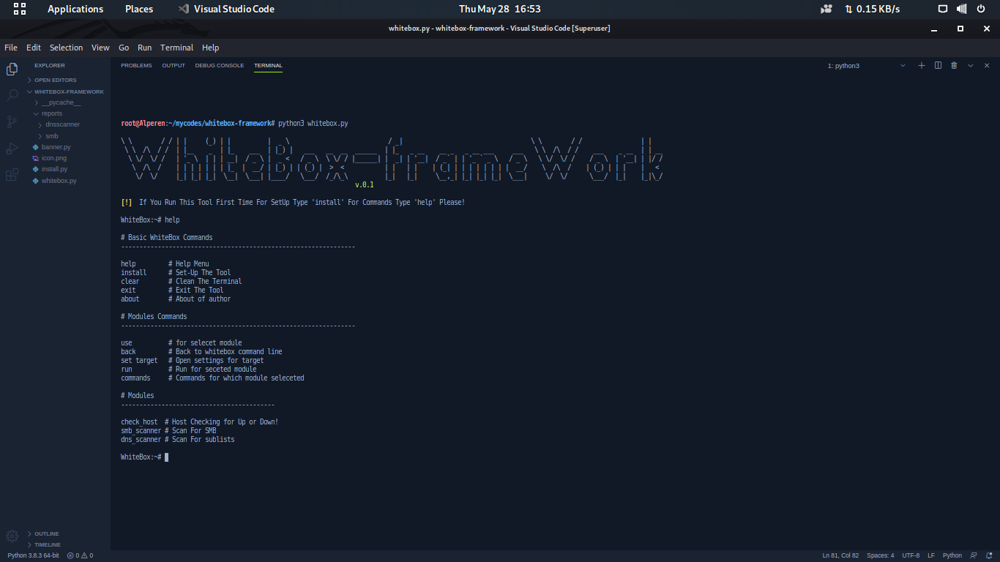
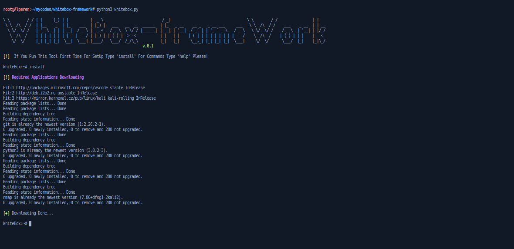
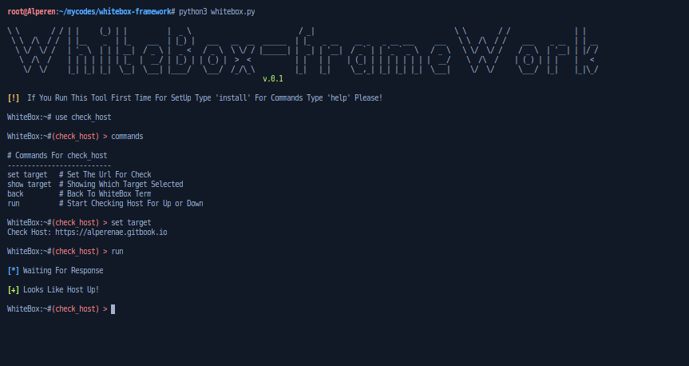
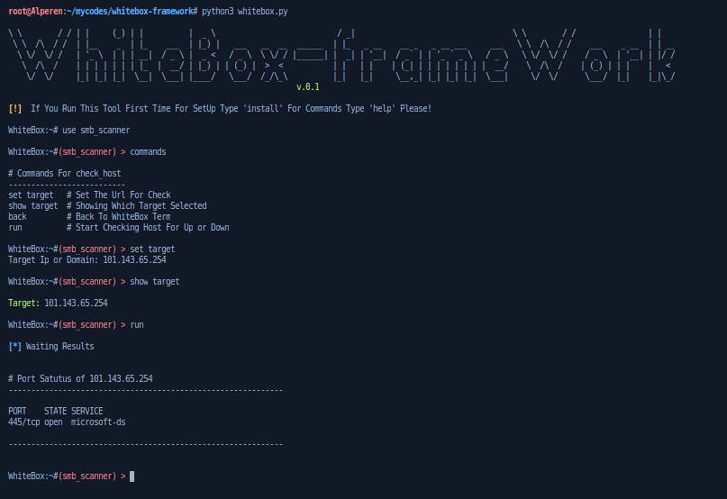
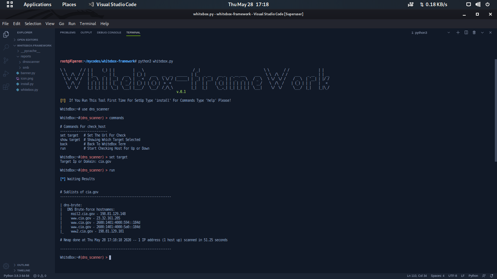

# WhiteBox-FrameWork  

WhiteBox-FrameWork is basic pentesting tool for now inside have three module.

<h2>Installation and setup</h2>

+ git clone https://github.com/Alperenae/whitebox-framework
+ cd whitebox-framework
+ chmod +x *
+ python3 whitebox.py

<h3>Modules</h3>

+ check_host
+ smb_scanner
+ dns_scanner

<h4>check_host</h4>

+ commands
+ set target (for set target press enter)
+ show target
+ run

<h4>smb_scanner</h4>

+ commands
+ set target (for set target press enter)
+ show target
+ run

  

<h4>dns_scanner</h4>

+ commands
+ set target (for set target press enter)
+ show target
+ run

# For Feedback!

+ alperen.ergel@yandex.com
+ alpern_ae @twitter
+ alperen_ae @instagram
